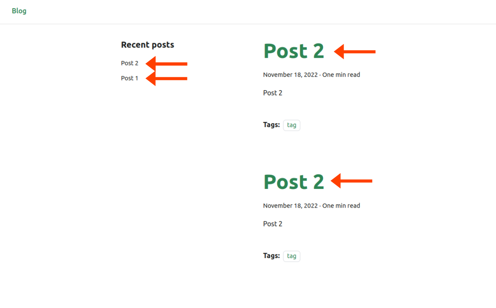
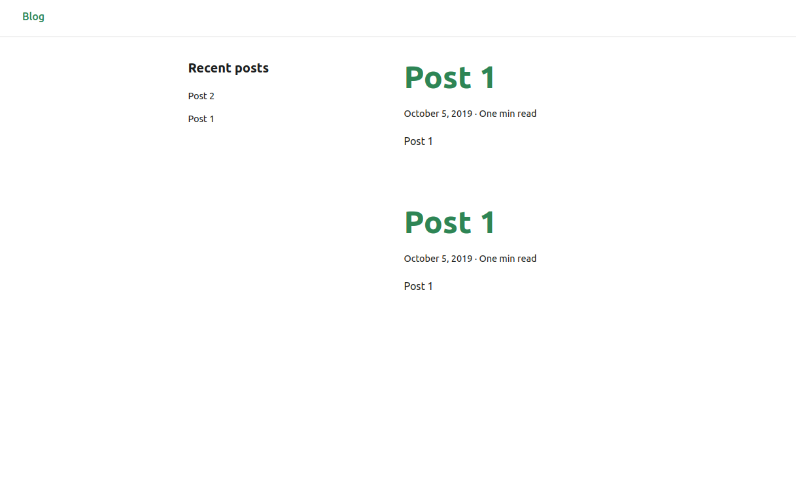

Minimum demo reproducing a bug in Docusaurus.

Run:

```sh
yarn && yarn start
```

In the blog, there are two posts: Post 1 and Post 2. We can see them in the list of recent posts. However, Post 1 is not present in the main list, and Post 2 is present twice:



We also notice this React error in the console:

```
react-dom.development.js?ac89:67 Warning: Encountered two children with the same key, `/blog/post2`. Keys should be unique so that components maintain their identity across updates.
```

> Note: it is still possible to build the site with `yarn build`, the error won't be present in the output.

Other observations:

- Renaming any of the two blog post folders (simply changing one character) fixes the issue (it looks like hashes colliding, so I tinkered in `docuHash` in `docusaurus-utils/src/hashUtils.ts` but it didn't do anything conclusive).

- Changing the 4th line of the Post 2 `index.mdx` file from `tags: [tag]` to `tags: []` makes now Post 1 being present twice instead of Post 2:


